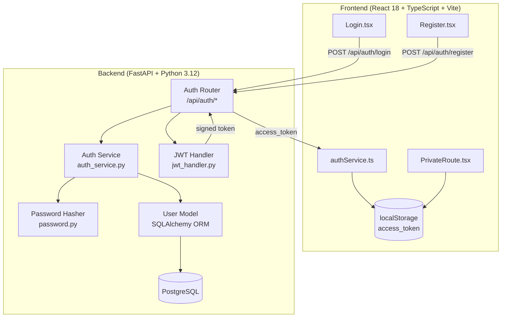

# Design Document: Authentication & User System

## Overview

This document describes the technical design for Sprint 1 of CampusHub — the complete
Authentication & User System. The sprint upgrades the existing SQLite-backed skeleton to a
production-ready stack: PostgreSQL + Alembic migrations, bcrypt password hashing via
`passlib[bcrypt]`, JWT token issuance and verification via `python-jose`, email-domain–based
automatic role assignment, and a React frontend with guarded routes.

The end-to-end happy path is:

```
Register (name + institutional email + password)
  → backend validates domain, auto-assigns role
  → bcrypt hashes password, stores user in PostgreSQL
  → respond 201
→ Login (email + password)
  → backend verifies credential, issues signed JWT
  → frontend stores JWT in localStorage
→ PrivateRoute reads JWT from localStorage
  → renders protected Home page
```

### Research Summary

- **passlib[bcrypt]** is the standard Python library for bcrypt password hashing; it handles
  random salt generation automatically, so two calls with the same password produce different
  hashes. Already listed in `requirements.txt`.
- **python-jose[cryptography]** provides JWT encode/decode with `HS256`. `create_access_token`
  and `decode_access_token` are already scaffolded in `app/auth/jwt_handler.py`. The upgrade
  adds a `verify_token` function that raises `HTTPException(401)` on failure.
- **Alembic** requires an `alembic.ini` and `env.py` pointed at the same `DATABASE_URL` as
  FastAPI. `autogenerate` will detect model changes and produce migration scripts.
- The existing skeleton uses `full_name` and `hashed_password` column names; the spec requires
  `name` and `password_hash`. The migration must rename / add columns accordingly.
- React `localStorage` + a `PrivateRoute` wrapper component is the standard SPA pattern for
  client-side auth guarding.

---

## Architecture

The system follows a layered architecture with clear separation between transport (FastAPI
routers), business logic (services), and data (SQLAlchemy models / PostgreSQL).



### Key Architectural Decisions

1. **Email-domain role assignment happens exclusively in Auth_Service**, not on the frontend.
   The frontend registration form removes the manual role selector entirely. This prevents
   role-spoofing from client-side manipulation.

2. **Two JWT modules exist in the skeleton** (`app/auth/jwt.py` and `app/auth/jwt_handler.py`).
   The design consolidates onto `jwt_handler.py`, adding a `verify_token()` function that
   raises `HTTPException(401)` on failure. `jwt.py`'s `get_current_user` dependency is kept
   for route protection but updated to call `verify_token`.

3. **Alembic lives at the project root**, separate from the `app/` package, with `env.py`
   importing `Base` from `app.database.database`. This is the standard FastAPI + Alembic
   layout.

4. **`startup_event` auto-create is removed** once Alembic is in place. `Base.metadata.create_all`
   is a dev convenience that conflicts with migration-managed schemas.

---

## Components and Interfaces

### Backend Components

#### 1. `app/models/user.py` — User Model

Replaces the current SQLite-era model with the full PostgreSQL-targeted schema.

```python
class UserRole(str, Enum):
    STUDENT = "STUDENT"
    FACULTY = "FACULTY"
    ADMIN   = "ADMIN"

class User(Base):
    __tablename__ = "users"
    id            # Integer, PK
    name          # String(255), nullable
    email         # String(255), unique, non-nullable
    password_hash # String(255), non-nullable
    role          # Enum(UserRole), non-nullable, default STUDENT
    branch        # String(100), nullable
    year          # Integer, nullable
    profile_photo # String(500), nullable
    bio           # Text, nullable
    campus_score  # Integer, default 0
    is_verified   # Boolean, default False
    created_at    # DateTime(timezone=True), server_default=now()
    updated_at    # DateTime(timezone=True), onupdate=now()
```

#### 2. `app/auth/password.py` — Password Hasher

No interface change needed; current implementation is correct:

```python
def hash_password(plain: str) -> str: ...
def verify_password(plain: str, hashed: str) -> bool: ...
```

#### 3. `app/auth/jwt_handler.py` — JWT Handler

Adds `verify_token` to the existing scaffold:

```python
def create_access_token(data: dict, expires_delta: timedelta | None = None) -> str: ...
def decode_access_token(token: str) -> dict | None: ...
def verify_token(token: str) -> dict:
    """Decodes the token; raises HTTPException(401) on expiry or tampering."""
```

Claims embedded in every token: `sub` (email), `id` (int), `role` (str), `exp` (UTC timestamp).

#### 4. `app/services/auth_service.py` — Auth Service

```python
ALLOWED_DOMAINS = {
    "mitsgwl.ac.in":   UserRole.STUDENT,
    "mitsgwalior.in":  UserRole.FACULTY,
}

def resolve_role(email: str) -> UserRole:
    """Splits at '@', looks up domain (case-insensitive). Raises ValueError for unknown domains."""

def get_user_by_email(db, email: str) -> User | None: ...
def create_user(db, name: str, email: str, password: str) -> User:
    """Calls resolve_role, hash_password; raises HTTPException(422) for bad domain, 409 for duplicate."""
def authenticate_user(db, email: str, password: str) -> User | None: ...
```

#### 5. `app/routers/auth.py` — Auth Router

| Endpoint                 | Method | Auth  | Description                        |
|--------------------------|--------|-------|------------------------------------|
| `/api/auth/register`     | POST   | None  | Creates user, returns `UserRead`   |
| `/api/auth/login`        | POST   | None  | Verifies creds, returns `Token`    |
| `/api/auth/me`           | GET    | Bearer| Returns current user's `UserRead`  |

The OTP endpoints remain for later sprints but are out of scope for authentication correctness.

#### 6. `app/schemas/user.py` — Pydantic Schemas

```python
class UserCreate(BaseModel):
    name: str | None
    email: EmailStr
    password: str = Field(min_length=8)

class UserRead(BaseModel):
    id: int
    name: str | None
    email: EmailStr
    role: str
    branch: str | None
    year: int | None
    profile_photo: str | None
    bio: str | None
    campus_score: int
    is_verified: bool
    created_at: datetime
    updated_at: datetime

class Token(BaseModel):
    access_token: str
    token_type: str = "bearer"

class LoginRequest(BaseModel):
    email: EmailStr
    password: str
```

`UserCreate` drops the manual `role` field. The `password` field uses Pydantic `Field(min_length=8)`
for the ≥ 8 character validation (returns 422 automatically).

#### 7. Alembic Setup

```
CampusHub/
  alembic.ini          ← script_location = alembic
  alembic/
    env.py             ← imports Base, reads DATABASE_URL
    versions/
      0001_initial_users_table.py
```

`env.py` must import all models before calling `autogenerate` so Alembic can detect them.

### Frontend Components

#### 1. `src/pages/auth/Register.tsx`

- Fields: `name`, `email`, `password`
- Removes the role `<select>`
- On success → navigate to `/login`
- On backend error → displays the `detail` string from the error response

#### 2. `src/pages/auth/Login.tsx`

- Fields: `email`, `password`
- On success → stores `access_token` in `localStorage`, navigates to `/`
- On failure → displays user-readable error message

#### 3. `src/routes/PrivateRoute.tsx` *(new file)*

```tsx
export function PrivateRoute() {
  const token = localStorage.getItem('access_token')
  return token ? <Outlet /> : <Navigate to="/login" replace />
}
```

#### 4. `src/routes/AppRoutes.tsx`

Updated to wrap protected routes with `<PrivateRoute>`:

```tsx
<Route element={<PrivateRoute />}>
  <Route path="/" element={<Home />} />
  {/* future protected routes */}
</Route>
```

#### 5. `src/services/authService.ts`

Adds a `getMe()` call and improves error propagation:

```typescript
register(payload: RegisterPayload): Promise<UserRead>
login(payload: LoginPayload): Promise<Token>
getMe(): Promise<UserRead>   // GET /api/auth/me with Authorization header
```

---

## Data Models

### `users` Table

| Column          | Type                        | Constraints                         |
|-----------------|-----------------------------|-------------------------------------|
| `id`            | `INTEGER`                   | PK, auto-increment                  |
| `name`          | `VARCHAR(255)`              | nullable                            |
| `email`         | `VARCHAR(255)`              | UNIQUE, NOT NULL, indexed           |
| `password_hash` | `VARCHAR(255)`              | NOT NULL                            |
| `role`          | `VARCHAR(20)` / enum        | NOT NULL, default `'STUDENT'`       |
| `branch`        | `VARCHAR(100)`              | nullable                            |
| `year`          | `INTEGER`                   | nullable                            |
| `profile_photo` | `VARCHAR(500)`              | nullable                            |
| `bio`           | `TEXT`                      | nullable                            |
| `campus_score`  | `INTEGER`                   | NOT NULL, default `0`               |
| `is_verified`   | `BOOLEAN`                   | NOT NULL, default `false`           |
| `created_at`    | `TIMESTAMP WITH TIME ZONE`  | NOT NULL, server default `now()`    |
| `updated_at`    | `TIMESTAMP WITH TIME ZONE`  | NOT NULL, auto-updated on change    |

### Alembic Migration Strategy

The initial migration (`0001_initial_users_table.py`) is auto-generated from the `User` model
using `alembic revision --autogenerate`. It drops the old columns (`full_name`,
`hashed_password`, `is_active`, `otp_code`) and creates the new schema. Because no production
data exists yet, a clean `create_table` is appropriate rather than `alter_table` rename.

The `alembic.ini` `sqlalchemy.url` is set to read from the environment:

```ini
sqlalchemy.url = %(DATABASE_URL)s
```

and `env.py` passes the URL via `config.set_main_option`.

### Token Payload Structure

```json
{
  "sub": "student@mitsgwl.ac.in",
  "id": 42,
  "role": "STUDENT",
  "exp": 1720000000
}
```

### Email Domain Mapping

| Email domain       | Assigned role |
|--------------------|---------------|
| `mitsgwl.ac.in`    | `STUDENT`     |
| `mitsgwalior.in`   | `FACULTY`     |
| anything else      | → HTTP 422    |

Domain comparison is case-insensitive (`email.split("@")[1].lower()`).

---

## Correctness Properties

*A property is a characteristic or behavior that should hold true across all valid executions of a
system — essentially, a formal statement about what the system should do. Properties serve as the
bridge between human-readable specifications and machine-verifiable correctness guarantees.*

This feature is well-suited for property-based testing because it contains pure functions
(password hashing, JWT encode/decode, domain-to-role mapping, input validation) where the input
space is large and edge cases (unicode passwords, mixed-case domains, arbitrary token payloads)
are important to cover. The properties below target these pure logic layers; infrastructure
integration (PostgreSQL, Alembic) is validated through integration tests instead.

---

### Property 1: Non-MITS domain registration is always rejected

*For any* email address whose domain is neither `mitsgwl.ac.in` nor `mitsgwalior.in`,
calling `auth_service.resolve_role(email)` SHALL raise a `ValueError` (and the router SHALL
return HTTP 422) and SHALL NOT create a user record.

**Validates: Requirements 2.3**

---

### Property 2: Domain comparison is case-insensitive

*For any* email address whose domain is a case variation of `mitsgwl.ac.in`
(e.g. `MITSgwl.AC.IN`, `MITSGWL.AC.IN`) or `mitsgwalior.in`, `resolve_role` SHALL return the
correct role (`STUDENT` or `FACULTY` respectively) — identical to the result for the all-lowercase
domain.

**Validates: Requirements 2.4**

---

### Property 3: Short passwords are always rejected

*For any* password string of length 0–7 characters paired with a valid MITS email, the
registration endpoint SHALL return HTTP 422 and SHALL NOT create a user record.
*For any* password string of length ≥ 8 characters, validation SHALL pass the length check.

**Validates: Requirements 3.3**

---

### Property 4: Stored credential is never plaintext

*For any* plaintext password string `p`, `hash_password(p)` SHALL return a value that is
not equal to `p`.

**Validates: Requirements 3.4, 4.1**

---

### Property 5: Password hash verify round-trip

*For any* non-empty plaintext password string `p`, `verify_password(p, hash_password(p))`
SHALL return `True`.

**Validates: Requirements 4.2**

---

### Property 6: Cross-password verification returns False

*For any* two plaintext password strings `p1` and `p2` where `p1 ≠ p2`,
`verify_password(p1, hash_password(p2))` SHALL return `False`.

**Validates: Requirements 4.3**

---

### Property 7: Bcrypt salt uniqueness

*For any* plaintext password string `p`, two successive calls to `hash_password(p)` SHALL
produce two different hash strings (bcrypt's per-call random salt ensures this).

**Validates: Requirements 4.4**

---

### Property 8: Token always contains required claims

*For any* valid user data tuple `(email: str, id: int, role: str)`, calling
`create_access_token({"sub": email, "id": id, "role": role})` SHALL produce a JWT whose decoded
payload contains all four claims: `sub`, `id`, `role`, and `exp`.

**Validates: Requirements 5.2**

---

### Property 9: JWT encode–decode round-trip

*For any* dictionary payload `p` containing `sub` (string), `id` (integer), and `role`
(string), encoding with `create_access_token(p)` and then decoding with `decode_access_token`
SHALL return a payload that contains equivalent values for `sub`, `id`, and `role`.

**Validates: Requirements 5.3, 5.6**

---

### Property 10: Invalid tokens always raise 401

*For any* token that has been tampered with (signature corrupted), or for any token whose
`exp` claim is in the past, calling `verify_token(token)` SHALL raise `HTTPException` with
status code 401.

**Validates: Requirements 5.4**

---

### Property 11: Login response token is persisted to localStorage

*For any* `access_token` string value returned by a successful login API response, the
`authService.login()` function SHALL store that exact string under the key `access_token` in
`localStorage`.

**Validates: Requirements 10.2**

---

### Property 12: PrivateRoute renders children for any non-empty token

*For any* non-empty string stored as `access_token` in `localStorage`, the `PrivateRoute`
component SHALL render its child outlet and SHALL NOT redirect to `/login`.

**Validates: Requirements 11.1**

---

## Error Handling

### Backend

| Scenario                              | HTTP Status | Response Body                            |
|---------------------------------------|-------------|------------------------------------------|
| Duplicate email on register           | 409         | `{"detail": "Email already registered"}` |
| Non-MITS email domain                 | 422         | `{"detail": "Email domain not allowed"}` |
| Password < 8 characters               | 422         | Pydantic validation error (auto)         |
| Invalid credentials on login          | 401         | `{"detail": "Invalid credentials"}`      |
| Unverified account login              | 403         | `{"detail": "Email not verified"}`       |
| Missing / invalid JWT on /me          | 401         | `{"detail": "Could not validate credentials"}` |
| Expired JWT on /me                    | 401         | `{"detail": "Could not validate credentials"}` |

**Design decisions:**
- `verify_token` in `jwt_handler.py` catches `JWTError` and `ExpiredSignatureError` and raises
  `HTTPException(status_code=401)`. Callers never see raw jose exceptions.
- `resolve_role` raises `ValueError`; the router catches it and re-raises as `HTTPException(422)`.
  This keeps the service layer free of FastAPI dependencies.
- HTTP 409 for duplicate email (not 400) because it represents a resource conflict, which is the
  semantically correct status code.

### Frontend

- Registration errors: `axios` interceptor passes through the `response.data.detail` string from
  the backend. `Register.tsx` displays this in a visible error `<div>` beneath the form.
- Login errors: same pattern. Error state is cleared on a new submission attempt.
- Network errors (5xx, unreachable): displayed as a generic "Server error, please try again."
- `PrivateRoute`: silent redirect to `/login` with `replace` (so the back button doesn't loop).

---

## Testing Strategy

### Backend — Unit & Property Tests (pytest + Hypothesis)

**Library:** `hypothesis` for property-based tests, `pytest` for all tests.

Property tests are configured with `settings(max_examples=100)` minimum. Each test is tagged
with a comment referencing the design property it validates.

```
Feature: authentication-user-system, Property N: <property_text>
```

**Test file layout:**
```
backend/tests/
  test_password.py       # Properties 4, 5, 6, 7
  test_jwt_handler.py    # Properties 8, 9, 10
  test_auth_service.py   # Properties 1, 2, 3
  test_auth_router.py    # Example-based: req 3.1, 3.2, 6.1–6.4, 7.1–7.3
```

**Unit tests (example-based)** cover:
- Happy-path register → 201 + UserRead
- Duplicate email → 409
- Valid login → 200 + Token
- Non-existent email login → 401
- Wrong password login → 401
- Unverified user login → 403
- GET /me with valid token → 200
- GET /me without token → 401
- GET /me with expired token → 401
- STUDENT and FACULTY domain assignments (2.1, 2.2)
- JWT expiry set to ~7 days (5.5)

**Integration tests** (run against a real PostgreSQL test database):
- Alembic upgrade head on empty database → no errors, tables exist
- Alembic upgrade head idempotency (req 8.3, 8.4)

### Frontend — Unit Tests (Vitest + React Testing Library)

**Library:** Vitest + `@testing-library/react` (already in the Vite ecosystem).

Tests cover:
- Register.tsx renders name, email, password fields; no role selector (req 9.1, 9.2)
- Register.tsx shows backend error on 422; does not navigate (req 9.3)
- Register.tsx navigates to /login on success (req 9.4)
- Login.tsx renders email and password fields (req 10.1)
- Login.tsx calls authService.login with correct payload (req 10.5)
- Login.tsx shows error on 401; does not navigate (req 10.4)
- Login.tsx navigates to / on success (req 10.3)
- PrivateRoute redirects to /login when localStorage is empty (req 11.2)
- **Property 11** (localStorage persistence): parameterized/property test over token strings
- **Property 12** (PrivateRoute renders for any token): parameterized test over token strings

### Dual-Coverage Summary

| Requirement area            | Unit/Example tests | Property tests                |
|-----------------------------|--------------------|-------------------------------|
| Password hashing            | ✓                  | Properties 4, 5, 6, 7         |
| JWT handling                | ✓                  | Properties 8, 9, 10           |
| Domain role assignment      | ✓                  | Properties 1, 2, 3            |
| Auth router endpoints       | ✓                  | —                             |
| Frontend pages              | ✓                  | Properties 11, 12             |
| Alembic / PostgreSQL        | Integration tests  | —                             |
